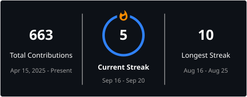

# Shubham Dangi

  <strong>Pre SWE · Full-Stack & Autonomous AI Systems</strong> 
  <em>Building high-stakes systems, agentic workflows, and production architectures.</em>

  
  

---

### 🔥 GitHub Activity & Contribution Streak

  

---

### 🚀 Featured Systems & Hackathons

- 🏆 **[DealFlow360 MSR](https://github.com/lab4-MSR/dealflow360-msr)** — Enterprise B2B deal flow and pipeline ERP system (*Odoo Hackathon 2026 Grand Finale Finalist, Gandhinagar*).
- 🤖 **[StartupLaunch AI](https://github.com/Shubham-997800/startuplaunchai)** — Autonomous multi-agent launch system for startup founders (*Kaggle × Google AI Agents Hackathon*). [Live Demo](https://startuplaunch30.vercel.app/)
- ⚡ **[FlowSync AI](https://github.com/Shubham-997800/FlowSyncAi)** — AI-powered productivity operating system with multi-provider AI (*Coding Ninjas × Google Vibe2Ship Hackathon*). [Live Demo](https://flowsyncai30.vercel.app/)
- 🎓 **[CAMPUS360](https://github.com/Shubham-997800/CAMPUS360)** — Full-stack smart university portal & campus management platform. [Live Demo](https://campus30.vercel.app/)

---

### 🛠️ Tech Stack & Tooling

  
  
  
  
  
  

